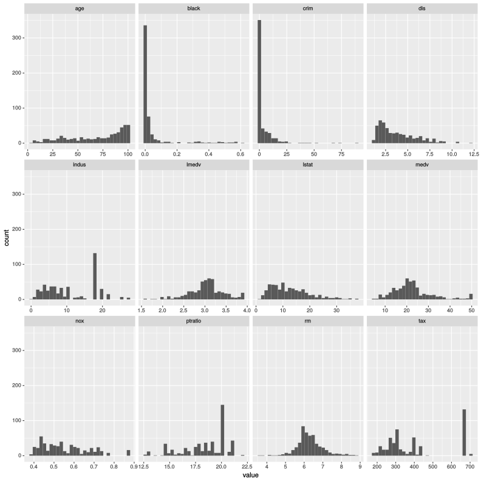
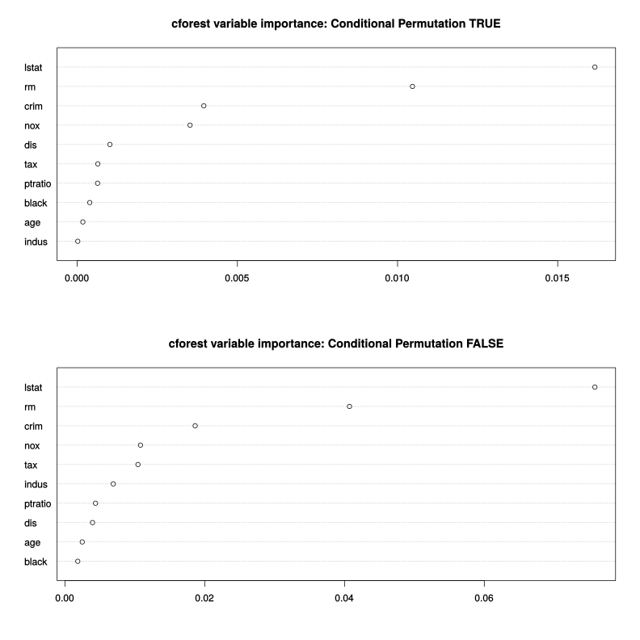
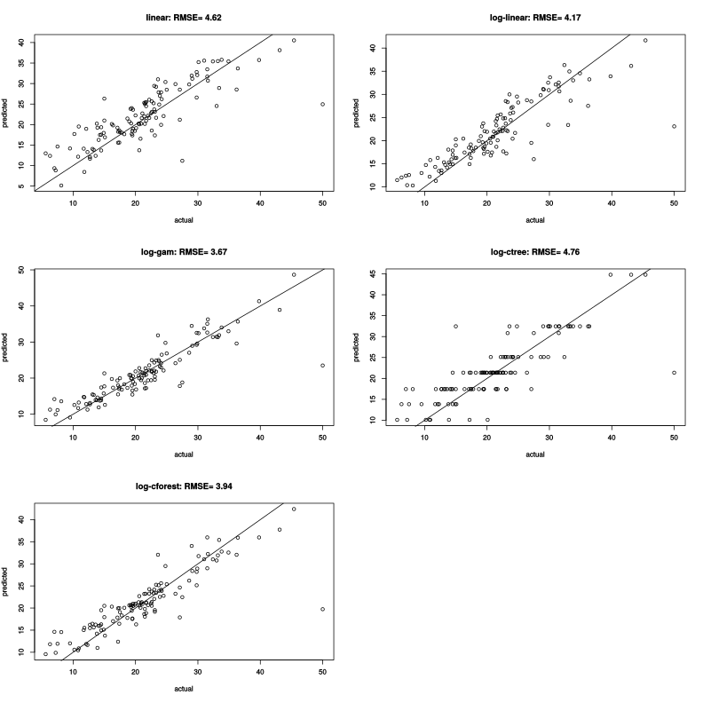

## Housekeeping

Start by looking for missing values: 


Table: Missing Values

 crim   zn   indus   chas   nox   rm   age   dis   rad   tax   ptratio   black   lstat   medv   lmedv
-----  ---  ------  -----  ----  ---  ----  ----  ----  ----  --------  ------  ------  -----  ------
    0    0       0      0     0    0     0     0     0     0         0       0       0      0       0

Note that proximity to the Charles river *chas* has been coded 0/1: convert to a factor with levels far and close.  The proportion of residential land zoned for lots over 25,000 sq.ft *zn* is mostly zero: convert to factor with levels zero and positive.  Variable *black* is $1000(Bk - 0.63)^2$ where *Bk* is the proportion of blacks by town: transform so *black* is proportion of blacks by town. Data is randomly split 75/25 into training and testing sets.

## Histograms of continuous variables




## Models: training set


```r
l.model <- lm(medv~ . , data=select(training, -lmedv))
ll.model <- lm(lmedv~ . , data=select(training, -medv))
gam.model <- gam(lmedv~zn+chas+rad+s(crim)+s(indus)+s(nox)+s(rm)+s(age)+s(dis)+s(tax)+s(ptratio)+s(black)+s(lstat), data=select(training, -medv))
ctree.model <- ctree(lmedv~. , control = ctree_control(mincriterion = .9999), data=select(training, -medv))
cforest.model <- cforest(lmedv~., data=select(training, -medv, -zn, -chas, -rad))
```

## OLS Results


<table style="text-align:center"><tr><td colspan="3" style="border-bottom: 1px solid black"></td></tr><tr><td style="text-align:left"></td><td colspan="2"><em>Dependent variable:</em></td></tr>
<tr><td></td><td colspan="2" style="border-bottom: 1px solid black"></td></tr>
<tr><td style="text-align:left"></td><td>medv</td><td>lmedv</td></tr>
<tr><td style="text-align:left"></td><td>(1)</td><td>(2)</td></tr>
<tr><td colspan="3" style="border-bottom: 1px solid black"></td></tr><tr><td style="text-align:left">crim</td><td>-0.096<sup>***</sup></td><td>-0.010<sup>***</sup></td></tr>
<tr><td style="text-align:left"></td><td>(0.035)</td><td>(0.001)</td></tr>
<tr><td style="text-align:left"></td><td></td><td></td></tr>
<tr><td style="text-align:left">znpositive</td><td>0.962</td><td>0.024</td></tr>
<tr><td style="text-align:left"></td><td>(0.878)</td><td>(0.034)</td></tr>
<tr><td style="text-align:left"></td><td></td><td></td></tr>
<tr><td style="text-align:left">indus</td><td>0.025</td><td>0.003</td></tr>
<tr><td style="text-align:left"></td><td>(0.072)</td><td>(0.003)</td></tr>
<tr><td style="text-align:left"></td><td></td><td></td></tr>
<tr><td style="text-align:left">chasclose</td><td>2.239<sup>**</sup></td><td>0.087<sup>**</sup></td></tr>
<tr><td style="text-align:left"></td><td>(0.982)</td><td>(0.038)</td></tr>
<tr><td style="text-align:left"></td><td></td><td></td></tr>
<tr><td style="text-align:left">nox</td><td>-23.180<sup>***</sup></td><td>-1.006<sup>***</sup></td></tr>
<tr><td style="text-align:left"></td><td>(4.412)</td><td>(0.171)</td></tr>
<tr><td style="text-align:left"></td><td></td><td></td></tr>
<tr><td style="text-align:left">rm</td><td>4.683<sup>***</sup></td><td>0.124<sup>***</sup></td></tr>
<tr><td style="text-align:left"></td><td>(0.485)</td><td>(0.019)</td></tr>
<tr><td style="text-align:left"></td><td></td><td></td></tr>
<tr><td style="text-align:left">age</td><td>-0.008</td><td>-0.0002</td></tr>
<tr><td style="text-align:left"></td><td>(0.016)</td><td>(0.001)</td></tr>
<tr><td style="text-align:left"></td><td></td><td></td></tr>
<tr><td style="text-align:left">dis</td><td>-1.477<sup>***</sup></td><td>-0.051<sup>***</sup></td></tr>
<tr><td style="text-align:left"></td><td>(0.244)</td><td>(0.009)</td></tr>
<tr><td style="text-align:left"></td><td></td><td></td></tr>
<tr><td style="text-align:left">rad</td><td>0.291<sup>***</sup></td><td>0.012<sup>***</sup></td></tr>
<tr><td style="text-align:left"></td><td>(0.079)</td><td>(0.003)</td></tr>
<tr><td style="text-align:left"></td><td></td><td></td></tr>
<tr><td style="text-align:left">tax</td><td>-0.009<sup>**</sup></td><td>-0.0004<sup>**</sup></td></tr>
<tr><td style="text-align:left"></td><td>(0.004)</td><td>(0.0002)</td></tr>
<tr><td style="text-align:left"></td><td></td><td></td></tr>
<tr><td style="text-align:left">ptratio</td><td>-1.134<sup>***</sup></td><td>-0.042<sup>***</sup></td></tr>
<tr><td style="text-align:left"></td><td>(0.159)</td><td>(0.006)</td></tr>
<tr><td style="text-align:left"></td><td></td><td></td></tr>
<tr><td style="text-align:left">black</td><td>-8.098<sup>***</sup></td><td>-0.361<sup>***</sup></td></tr>
<tr><td style="text-align:left"></td><td>(2.492)</td><td>(0.097)</td></tr>
<tr><td style="text-align:left"></td><td></td><td></td></tr>
<tr><td style="text-align:left">lstat</td><td>-0.426<sup>***</sup></td><td>-0.024<sup>***</sup></td></tr>
<tr><td style="text-align:left"></td><td>(0.059)</td><td>(0.002)</td></tr>
<tr><td style="text-align:left"></td><td></td><td></td></tr>
<tr><td style="text-align:left">Constant</td><td>39.740<sup>***</sup></td><td>4.184<sup>***</sup></td></tr>
<tr><td style="text-align:left"></td><td>(5.741)</td><td>(0.223)</td></tr>
<tr><td style="text-align:left"></td><td></td><td></td></tr>
<tr><td colspan="3" style="border-bottom: 1px solid black"></td></tr><tr><td style="text-align:left">Observations</td><td>387</td><td>387</td></tr>
<tr><td style="text-align:left">R<sup>2</sup></td><td>0.744</td><td>0.792</td></tr>
<tr><td style="text-align:left">Adjusted R<sup>2</sup></td><td>0.735</td><td>0.785</td></tr>
<tr><td style="text-align:left">Residual Std. Error (df = 373)</td><td>4.882</td><td>0.189</td></tr>
<tr><td style="text-align:left">F Statistic (df = 13; 373)</td><td>83.340<sup>***</sup></td><td>109.300<sup>***</sup></td></tr>
<tr><td colspan="3" style="border-bottom: 1px solid black"></td></tr><tr><td style="text-align:left"><em>Note:</em></td><td colspan="2" style="text-align:right"><sup>*</sup>p<0.1; <sup>**</sup>p<0.05; <sup>***</sup>p<0.01</td></tr>
</table>

## GAM Partial Plots


## Conditional Inference Tree


## Variable importance cforest



## Predicted vs Actual: testing set 



